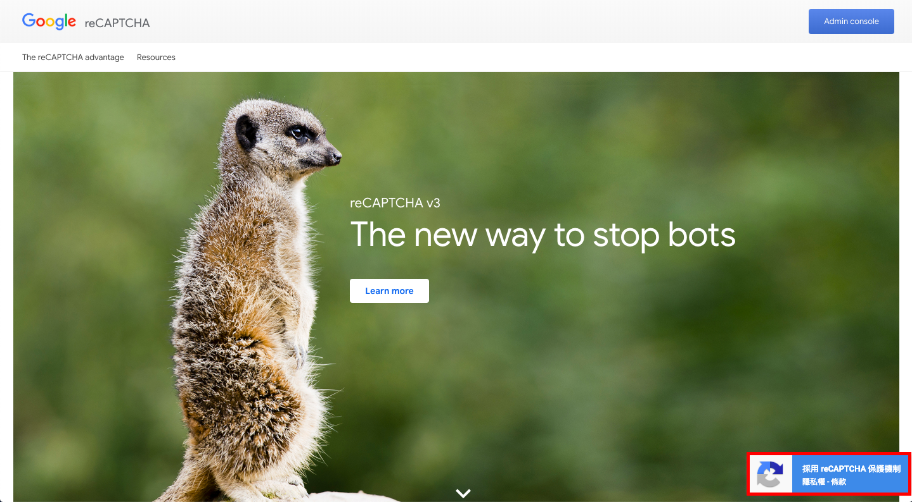

# Google-reCaptcha-V3
You can learn how to use reCaptcha v3 on your website.

Using curl to send a request.

## File in each side
### Client side : frontEnd.html, frontEnd.js
### Server side : backEnd.php

You can get your own recaptcha key by this [link](https://www.google.com/recaptcha/intro/v3.html "Google").

### If it runs successfully, there will be a icon on the bottom right of the page.
### Like https://www.google.com/recaptcha/intro/v3.html.

